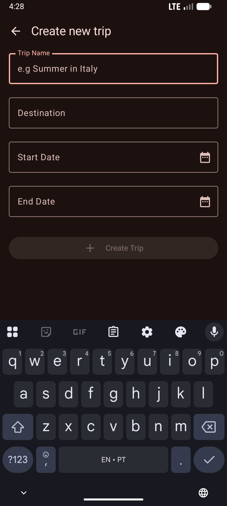
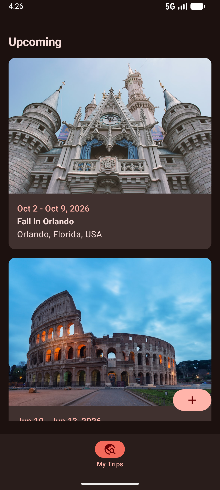
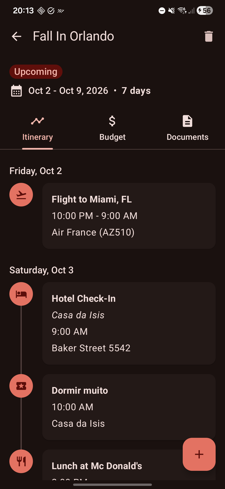
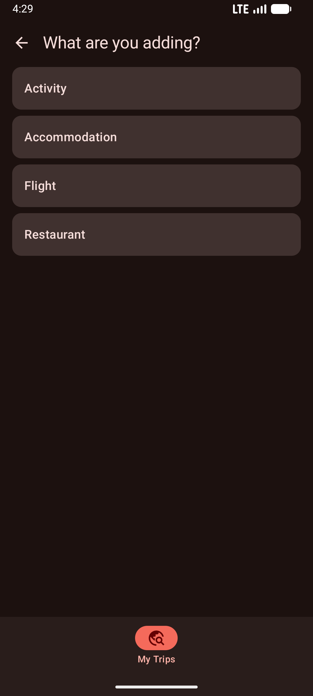

# Redknot

A trip planning Android app built with Kotlin and Jetpack Compose.

## Features

- Create, view, edit, and delete trips
- Manage itinerary items per trip: flights, accommodations, restaurants, and activities

## Screenshots
<p float="left">
   
   
   
   
</p>

## Tech Stack

| Layer | Library |
|---|---|
| UI | Jetpack Compose + Material 3 |
| Architecture | Clean Architecture + MVVM (MVI-style) |
| Navigation | androidx.navigation3 |
| DI | Hilt |
| Database | Room |
| Networking | Retrofit + OkHttp |
| Image loading | Coil |
| Testing | JUnit 5 + MockK + Turbine |
| Static analysis | Detekt |

**Min SDK:** 24 | **Target SDK:** 36

## Module Structure

```
redknot/
├── :app                  # Entry point, navigation host, bottom bar
├── :core
│   ├── :common           # Base ViewModels, Hilt dispatcher qualifiers
│   └── :testing          # Shared test utilities (MainDispatcherRule)
├── :designsystem         # Compose components, Material 3 theme, spacing tokens
└── :feature:trip
    ├── :api              # Public navigation routes & interfaces
    └── :impl             # Data, domain, and presentation layers
```

## Setup

1. Add your Unsplash API key to `local.properties` at the project root:
   ```
   UNSPLASH_ACCESS_KEY=your_key_here
   ```
2. Build and run via Android Studio or:
   ```bash
   ./gradlew assembleDebug
   ```
