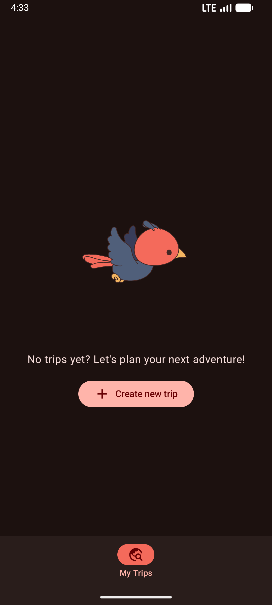

# Redknot

A trip planning Android app built with Kotlin and Jetpack Compose.

## Features

- Create, view, edit, and delete trips
- Manage itinerary items per trip: flights, accommodations, restaurants, and activities
- Track budget and expenses per trip (adding and categorizing expenses)
- Document management per trip (storing travel documents, tickets, and bookings)

## Screenshots
<p float="left">
   
   
   
  
</p>

## Tech Stack

| Layer | Library |
|---|---|
| UI | Jetpack Compose + Material 3 |
| Architecture | Clean Architecture + MVI |
| Navigation | androidx.navigation3 |
| DI | Hilt |
| Database | Room |
| Networking | Retrofit + OkHttp |
| Image loading | Coil |
| Testing | JUnit 5 + MockK + Turbine |
| Static analysis | Detekt |

**Min SDK:** 24 | **Target SDK:** 36

## Module Structure

```
redknot/
├── :app                  # Entry point, navigation host, bottom bar
├── :core
│   ├── :common           # Base ViewModels, Hilt dispatcher qualifiers
│   ├── :designsystem     # Compose components, Material 3 theme, spacing tokens
│   └── :testing          # Shared test utilities (MainDispatcherRule)
└── :feature:trip
    ├── :api              # Public navigation routes & interfaces
    └── :impl             # Data, domain, and presentation layers (Trip, Itinerary, Budget, Documents)
```

## Architecture

The project is built following **Clean Architecture** principles combined with the **MVI (Model-View-Intent)** presentation pattern to ensure a highly scalable, testable, and maintainable codebase.

### Layered Flow & Communications

```text
           [ Compose Screen (UI) ] 
             │                 ▲
             │ (dispatches)    │ (renders)
             ▼                 │
       ┌───────────┐     ┌───────────┐
       │  UiEvent  │     │  UiState  │
       └─────┬─────┘     └─────▲─────┘
             │                 │ (updates)
             ▼                 │
       ┌─────────────────────────────┐
       │          ViewModel          ├─────────┐
       └──────────────┬──────────────┘         │ (sends)
                      │                        ▼
                      │ (invokes)        ┌───────────┐
                      ▼                  │  UiEffect │
               ┌─────────────┐           └─────┬─────┘
               │  Use Cases  │                 │ (triggers one-shot)
               └──────┬──────┘                 ▼
                      │ (calls)          [ Compose Screen (UI) ]
                      ▼
               ┌─────────────┐
               │ Repository  │
               └──────┬──────┘
                      │ (queries / fetches)
            ┌─────────┴─────────┐
            ▼                   ▼
    ┌──────────────┐    ┌──────────────┐
    │   Local DB   │    │  Remote API  │
    │    (Room)    │    │  (Retrofit)  │
    └──────────────┘    └──────────────┘
```

This ensures a strict separation of concerns across three main layers:
- **Presentation Layer (MVI)**: Screen-level Composables observe `UiState` and dispatch `UiEvent`s to a Hilt-injected `ViewModel`. The ViewModel maps events to domain/data operations, updates `UiState`, and exposes side-effects as one-shot `UiEffect`s.
- **Domain Layer**: Contains platform-independent business logic represented by functional, single-purpose **Use Cases**.
- **Data Layer**: Coordinates data sourcing from a local SQLite database (**Room**) or a remote service (**Retrofit**), managed through repositories that return `Result<T>` wrappers to the domain layer.


### Core Architecture Principles

1. **Unidirectional Data Flow (UDF)**:
   - **UiState**: A single, immutable state representation exposed to the UI as a `StateFlow`.
   - **UiEvent**: Immutable user actions dispatched from Compose screens to the ViewModel using a unified `dispatchEvent(event)` method. All business methods in the ViewModel are `private` to enforce this.
   - **UiEffect**: One-shot side-effects (e.g., navigation, showing toast messages) sent via a `Channel` and collected exactly once in Compose screens using `CollectUiEffects`.

2. **ViewModel Hierarchy**:
   - `ViewModel<State : UiState, Event : UiEvent, Effect : UiEffect>`: Used when the screen requires MVI events and one-shot side effects.
   - `StateViewModel<State : UiState, Event : UiEvent>`: Used when only state and event handling are needed, without side effects.

3. **Module & Directory Structure**:
   - Each sub-feature within `:feature:trip` (e.g., `trip`, `itinerary`, `budget`, `documents`) is cleanly separated into its own `data`, `domain`, and `presentation` layers.
   - **Encapsulation**: Classes (ViewModels, Use Cases, Repositories, DI modules) are declared as `internal` by default. Only navigation routes and top-level feature entry points are public.

4. **Dependency Injection**:
   - **Hilt** is used project-wide for dependency injection, configured with standard lifecycle scopes and custom dispatcher qualifiers (`@IoDispatcher`, `@DefaultDispatcher`, `@MainDispatcher`) to manage threading.

## Setup

1. Add your Unsplash API key to `local.properties` at the project root:
   ```
   UNSPLASH_ACCESS_KEY=your_key_here
   ```
2. Build and run via Android Studio or:
   ```bash
   ./gradlew assembleDebug
   ```
